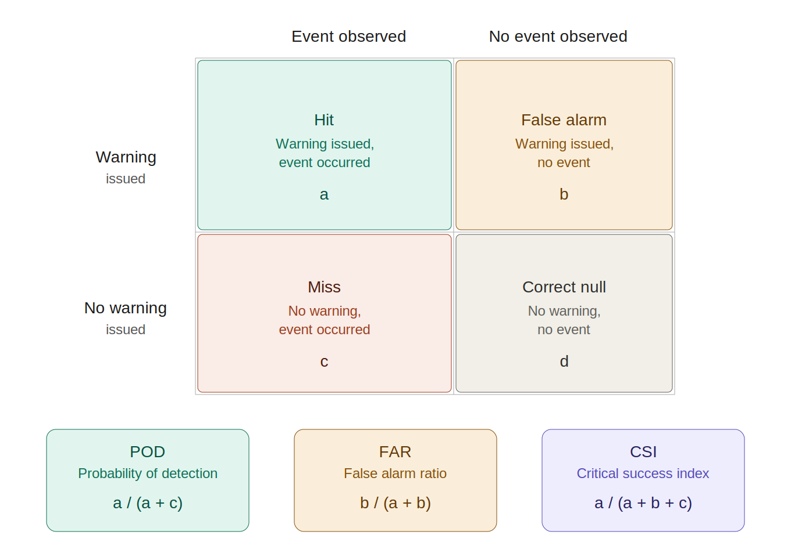

# NWS Staffing Analysis

## Research Question

Did NWS staffing cuts in 2025 result in statistically significant changes in warning performance?

## Data Source

**COW API** (`mesonet.agron.iastate.edu/api/1/cow.json`)

- 122 WFOs x 6 complete calendar years (2020-2025)
- Filtered to phenomena: **TO** (Tornado), **SV** (Severe Thunderstorm), **FF** (Flash Flood)
- Collected May 2026; 2025 is a full year with no partial-year bias
- Year boundary verified: no duplicate or misassigned events across year files

### Data Provenance

The COW API is a read-through of official NWS operational data; IEM introduces no modeled or derived fields beyond the verification join. The full ingestion chain is:

1. **NOAAPort / NOAA Satellite Broadcast Network (SBN)** — NWS issues warning and LSR text products operationally; they are broadcast in real time over the NOAA satellite network.
2. **Unidata LDM** — Iowa State subscribes to the NOAAPort feed via Unidata's Logical Data Manager, receiving the full NWS product stream.
3. **pyWWA parsers** — IEM's open-source [pyWWA](https://github.com/akrherz/pyWWA) project runs daemon parsers that decode incoming products and write them to the IEM PostgreSQL database: `vtec_parser.py` → `sbw` table (Storm-Based Warning polygons); `lsr_parser.py` → `lsrs` table (Local Storm Reports).
4. **COW verification join** — `iem-web-services/src/iemws/services/cow.py` queries `sbw` and `lsrs`, spatially matches LSRs to warning polygons, and applies the time constraint `lsr.valid >= warning.issue AND lsr.valid <= warning.expire`. `lead0` is computed as `int((lsr.valid − warning.issue).total_seconds() / 60)`.

Because the source is the live NWS operational product stream (not NCEI archives or reanalysis), event and LSR records match what forecasters actually issued and received in real time.

## Data Storage

```
data/
├── wfo_list.csv
├── 01_collection/
│   └── COW/
│       └── {WFO}_{YEAR}.json   # one file per WFO-year, immutable
├── 02_extraction/              # flattened CSV, immutable checkpoint before cleaning
└── 03_cleaning/                # cleaned, analysis-ready files
```

## Data Model

Two tables in `data/03_cleaning/`, one row per warning event and one row per Local Storm Report.

### events (161,404 rows)

| Field | Type | Description |
|---|---|---|
| `wfo` | str | NWS Weather Forecast Office call sign (e.g. `OUN`) |
| `year` | int | Calendar year (2020–2025); derived from filename, not API |
| `phenomena` | str | VTEC phenomena code: `TO`, `SV`, or `FF` |
| `eventid` | int | API-assigned event identifier; unique within WFO-year-phenomena |
| `product_id` | str | Derived join key: `{year}{wfo}{eventid}{phenomena}W1` (e.g. `2020OUN41TOW1`) |
| `issue` | datetime (UTC) | Warning issuance time |
| `expire` | datetime (UTC) | Warning expiration time |
| `duration_min` | float | Warning duration in minutes (`expire − issue`); derived |
| `status` | str | Terminal issuance status: `EXP`, `CAN`, `COR`, `EXT`, `CON`, or `NEW` |
| `verify` | bool | `True` if at least one confirming LSR was matched to this warning |
| `lead0` | float | Lead time in minutes to the first confirming LSR; null for unverified events (53.7%) |
| `lead0_capped` | bool | `True` if `lead0` was capped at the 99th percentile for its phenomena |

### stormreports (236,800 rows)

| Field | Type | Description |
|---|---|---|
| `wfo` | str | NWS Weather Forecast Office call sign |
| `year` | int | Calendar year (2020–2025); derived from filename, not API |
| `valid` | datetime (UTC) | Time the storm report was filed |
| `lsrtype` | str | LSR phenomena type: `TO`, `SV`, or `FF` |
| `typetext` | str | Human-readable description of the report type |
| `warned` | bool | `True` if a matching warning was in effect at report time |
| `leadtime` | float | Minutes between warning issuance and report time; null for unwarned reports (23.2%) |
| `leadtime_capped` | bool | `True` if `leadtime` was capped at the 99th percentile for its lsrtype |
| `events` | str | Comma-separated VTEC product IDs linking this report to matched warnings; null for unwarned reports (19.9%) |
| `tdq` | bool | `True` if NWS marked this report "Too Difficult to Qualify" — not a confirmed hazardous event |
| `source` | str | Normalized report source (e.g. `TRAINED SPOTTER`, `EMERGENCY MNGR`, `PUBLIC`) |
| `city` | str | City of the report location; imputed via Nominatim where null |
| `county` | str | County of the report location; imputed via Nominatim where null |
| `state` | str | Two-letter state code |
| `lon0` | float | Longitude of the report location (exact point geometry) |
| `lat0` | float | Latitude of the report location (exact point geometry) |
| `remark` | str | Free-text narrative from the reporting observer; null for 11.5% of rows |

## Analysis Design

- **Pre/post split:** 2020-2024 baseline, 2025 treatment
- **Primary metrics:** POD, FAR, CSI, and avg lead time derived from event-level data
- **Staffing treatment:** 2025 NWS staffing cuts treated as a system-wide intervention; no WFO-level staffing covariate (see Methodological Notes)



## Reproducibility

The cleaned analysis files (`data/03_cleaning/events.csv` and `stormreports.csv`) are not tracked in this repository due to size. Two paths to reproduce them:

**Option A — Use the published data deposit (recommended)**

The cleaned tables are archived at:

> *Zenodo DOI: [to be added upon paper submission]*

Download the two CSVs and place them in `data/03_cleaning/`. Notebooks `04_eda.ipynb` onward can then be run directly.

**Option B — Re-run the pipeline**

Run the notebooks in order: `01_collection` → `02_extraction` → `03_cleaning`. Note:

- Collection makes 732 API calls (122 WFOs × 6 years) and takes ~40 minutes (~3 sec/file).
- IEM may backfill or correct LSRs after the fact; results may differ slightly from the published deposit if re-collected on a different date.
- The published deposit reflects data collected **May 2026**; 2025 is a complete calendar year with no partial-year bias at that date.
- Nominatim geocoding (used to impute null city/county values in `03_cleaning`) queries the OpenStreetMap API and results may vary over time as OSM data changes.

## Notebooks

| Notebook | Purpose |
|---|---|
| `01_collection.ipynb` | Fetch raw COW API data for all WFOs and years |
| `02_extraction.ipynb` | Flatten raw JSON into events and stormreports tables |
| `03_cleaning.ipynb` | Type casting, null handling, and field normalization |
| `04_eda.ipynb` | Exploratory data analysis and feature engineering |
| `05_analysis.ipynb` | Statistical tests and before/after comparisons |
| `06_synthesis.ipynb` | Findings and visualizations for the paper |

## Methodological Notes

1. **LSR underreporting:** LSRs are filed voluntarily; miss rates should be interpreted as "among reported events." A drop in unwarned reports in 2025 could reflect fewer LSRs filed, not better performance.
2. **No WFO-level staffing covariate:** `fcster` was investigated as a staffing proxy but abandoned — rolling 3-month analysis showed chronic format mixing (badge numbers, last names, initials coexisting) in 118 of 122 WFOs, making unique-count comparisons unreliable. No public WFO-level staffing dataset exists. The analysis treats 2025 as a system-wide treatment without a per-office staffing dose variable.
3. **IEM API field overflow:** A fixed-width serialization bug in the IEM API corrupts adjacent columns when a long `remark` is present, affecting 26 storm report rows across 10 WFOs. Four corruption patterns were identified during EDA (lat0 truncation with and without a clean duplicate, lon0 sign loss, junk state/county) and are repaired in `COWCleaner.repair_malformed_rows()` rather than dropped, preserving 8 rows that would otherwise be lost.
4. **`lead0` semantics (POD₂, not POD₁):** The COW verification join requires `lsr.valid >= warning.issue` (source: `iem-web-services/cow.py`), so no warning can be verified by an LSR that preceded its issuance, and `lead0` is never negative. `lead0 = int((lsr.valid − warning.issue).total_seconds() / 60)` — integer truncation of sub-60-second differences produces the 5.4% of verified events with `lead0=0`, meaning the warning was issued within the same minute as the LSR. This is **POD₂ semantics** in Brooks & Correia (2018) terms: a warning counts as verified whether it precedes or coincides with the event onset. IEM lead time averages will therefore be slightly higher than POD₁-only LTA estimates (~18.8 min pre-2012, ~15.6 min post-2012 from Brooks & Correia), but the year-over-year comparison remains valid since the definition is consistent across all years.
5. **Treatment is not a clean step function:** The 2025 staffing reduction unfolded in phases — probationary terminations (February 27), deferred resignations departing (April), and a partial rehiring wave (August, after NWS received a public safety exemption). A simple pre/post split treats 2025 as uniformly treated; interrupted time series or sensitivity analyses with alternate cut points should be considered.
6. **Small-sample WFOs:** WFOs with very few events in a year will produce unreliable per-WFO statistics. A minimum events threshold may be needed.
7. **Non-CONUS offices:** Alaska, Hawaii, Guam, and Puerto Rico have fundamentally different weather patterns. Consider flagging or excluding from the main analysis.

## AI Assistance

This project was developed in collaboration with [Claude](https://claude.ai) (Anthropic), an AI assistant. Claude contributed to code architecture and implementation (`src/` classes, cleaning pipeline), data investigation (IEM API field overflow bug, data provenance research, `lead0` semantics), literature search and annotation (`report/literature.md`), and documentation. All analytical decisions, research direction, and final outputs were made by the author.
